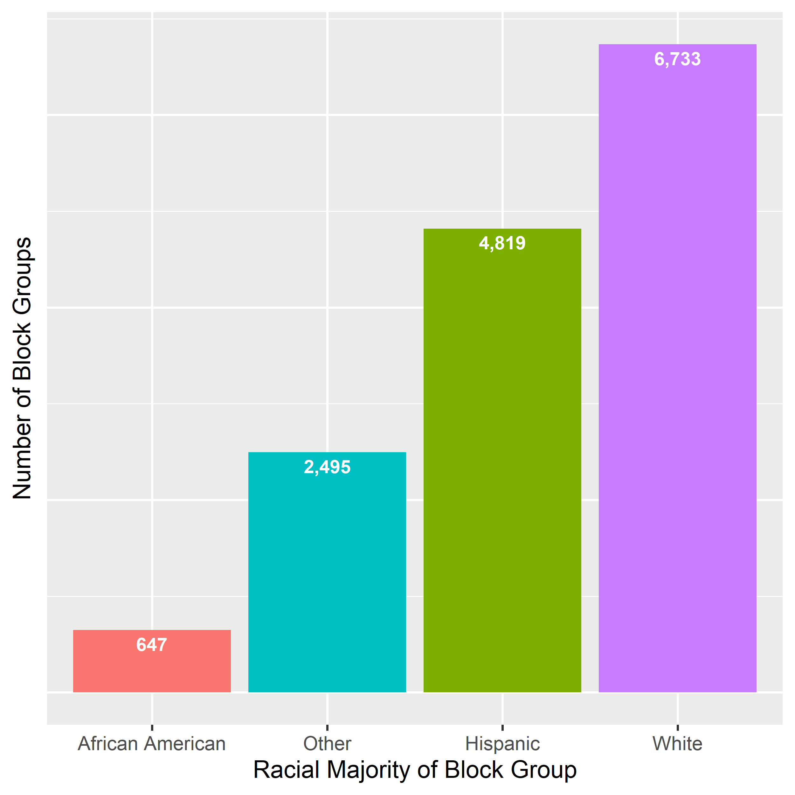
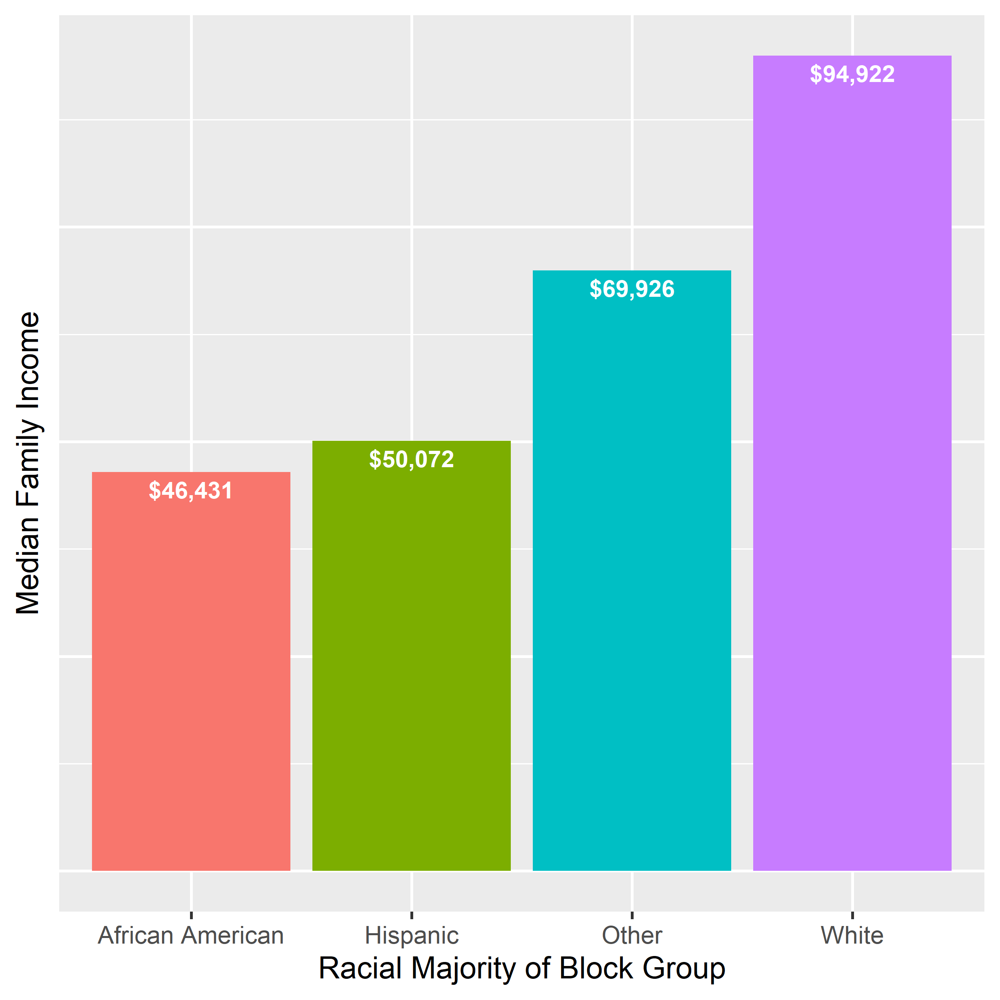

```{r setup, include=FALSE}
knitr::opts_chunk$set(eval=FALSE,echo = TRUE, warning=FALSE, message=FALSE)
```

##### Using TIDYCENSUS to collect Census data for Block Groups

This code downloads basic Census data for BLOCK GROUPS. It's more convoluted than it should be. There is a work-around, but it is clunky.This is a Census issue, not an R issue or `tidycensus` issue. 

##### [You can check the discussion at this link](https://github.com/walkerke/tidycensus/issues/136){target="_blank"}.

<BR>

##### Libraries needed and numbering format
<BR>

```{r, results="hide"}
library(tidycensus);library(tidyverse);library(tibble);library(data.table);
library(dplyr);library(lubridate);library(ggplot2);library(scales)

options(scipen=999)
```
<BR>

##### Census Tables Available

The first trick is figuring out which tables we need from the Census tables. The `tidycensus` library makes this super-easy. But once you load the list of tables, you have to scroll through that table and figure out the exact table you need. Note that not all tables in the list are available at the Block Group level for all time points. But you can search the list if you view the table and then use the search tool on the top right of the list.

```{r eval=FALSE, message=FALSE, warning=FALSE, results='hide'}
v17 <- load_variables(2018, "acs5", cache = TRUE)
view(v17)
```
<BR>

##### Downloading the Data

Now comes the ugly part. The Census Bureau only makes the block group data available by county. 

So, you have to define every state and county you want a variable for, and then download it BY COUNTY. This can be iterated, but it is slow, at least the way I did it. There is supposedly an IPUMS way to download this for the whole US, but for this analysis, I just downloaded the block groups for Texas. I could only do this for one variable at a time, so I just ran the following code for each Census Table I wanted to download, and created a data.table for each. So, the code below was run for each variable, and the name of the data.table was changed for each variable I downloaded.

The IPUMS workaround is supposed to be better, but I haven't tried it.

##### [You may want to check into it here](https://developer.ipums.org/docs/get-started/){target="_blank"}.


For this Texas data, each variable download took several minutes. But I was working on my home laptop over wifi, so you can probably achieve significantly faster download times.

```{r eval=FALSE, message=FALSE, warning=FALSE, results='hide'}
# Define the states you want to download. 
# Each state adds more time to the download.

my_states <- c("TX")

# Add the counties for each of the states.

my_counties <- fips_codes %>%
  filter(state %in% my_states)

# Combines the state list and county list to specify the geographies 
# you want to download.

county_state <- tigris::counties(
  state = my_states,
  cb = TRUE,
  resolution = "20m",
  year = "2018",
  class = "sf"
)

# Download the BLOCK GROUP data. 
# Change the table name and variable (Census table) each time.

medfaminc <- map2_dfr(
  .x = county_state$STATEFP,
  .y = county_state$COUNTYFP,
  ~ get_acs(
    geography = "block group",
    variables = "B19113_001",
    state = .x,
    county = .y
  )
)
```
<BR>

##### Cleaning and Merging the Data

For this project, I downloaded:

* AApop =    # of African Americans in block group   (B03002_004)
* txHispop = # of Hispanics in block group           (B03003_003)
* txwpop =   # of non-Hispanic whites in block group (B03002_003)
* txtotpop = # of total population in block group    (B02001_001)
* txmedinc = median family income of block group     (B19113_001)

These Census Tables are downloaded as a separate data.table with a long text name and the measurement error, in addition to the geo-id and variable of interest. So, the code below cleans up each data.table a bit and changes the geo-id name in each so that the variables do not have the same name when they are combined.

Since all the data.files are exactly the same length, they can easily be combined with `cbind`.

The combined data.table is then cleaned up by removing the repetitious geo-id columns, with the remaining geo-id column renamed GEOID.


```{r eval=FALSE, message=FALSE, warning=FALSE, results='hide'}
AApop <- select(AApop,-c(moe,NAME,variable))
names(AApop)[names(AApop) == "estimate"] <- "AApop"
names(AApop)[names(AApop) == "GEOID"] <- "GEOIDaa"

txHispop <- select(txHispop,-c(moe,NAME,variable))
names(txHispop)[names(txHispop) == "estimate"] <- "Hispop"
names(txHispop)[names(txHispop) == "GEOID"] <- "GEOIDhisp"

txwpop <- select(txwpop,-c(moe,NAME,variable))
names(txwpop)[names(txwpop) == "estimate"] <- "wpop"
names(txwpop)[names(txwpop) == "GEOID"] <- "GEOIDw"

txtotpop <- select(txtotpop,-c(moe,NAME,variable))
names(txtotpop)[names(txtotpop) == "estimate"] <- "totpop"
names(txtotpop)[names(txtotpop) == "GEOID"] <- "GEOIDtot"

txmedinc <- select(txmedinc,-c(moe,NAME,variable))
names(txmedinc)[names(txmedinc) == "estimate"] <- "medinc"
names(txmedinc)[names(txmedinc) == "GEOID"] <- "GEOIDinc"

txbg <- cbind(txtotpop,AApop,txHispop,txwpop,txmedinc)

txbg <- select(txbg,-c(3,5,7,9))
names(txbg)[names(txbg) == "GEOIDtot"] <- "GEOID"
```
<BR>

##### Creating some ratios and categories

I am interested in block groups with minority majorities and with low incomes, so I create som variables with percentages and then create categories based on those percentages. 

Then I can create one categorical variable for block groups that have:

* African American population majority
* Hispanic population majority
* White population majority
* All other block groups 


```{r eval=FALSE, message=FALSE, warning=FALSE, results='hide'}
txbg$AAper <- txbg$AApop/txbg$totpop*100
txbg$wper <- txbg$wpop/txbg$totpop*100
txbg$Hper <- txbg$Hispop/txbg$totpop*100

txbg$hiscat <- if_else(txbg$Hper>50,1,0)  
txbg$aacat <- if_else(txbg$AAper>50,1,0)
txbg$wcat <- if_else(txbg$wper>50,1,0)

summary(txbg$medinc)  
txbg$inccat <- if_else(txbg$medinc>63965,1,0)

txbg$cat <- "Other"
txbg$cat <- if_else(txbg$aacat==1,"African American",txbg$cat)
txbg$cat <- if_else(txbg$hiscat==1,"Hispanic",txbg$cat)
txbg$cat <- if_else(txbg$wcat==1,"White",txbg$cat)
txbg$cat <- as.factor(txbg$cat)
txbg$cat <- as.character(txbg$cat)
```
<BR>

##### Final clean up

Convert the data to a tibble and drop the cases with missing data.


```{r eval=FALSE, message=FALSE, warning=FALSE, results='hide'}

txbg <- as_tibble(txbg)
txbg <- na.omit(txbg)

write.csv(txbg,"txbg.csv")
```
<BR>

##### Counting cases of the categories

Using `group_by` allows me to make a nice plot of the counts of the categories. I save that as a high-res png file.


```{r eval=FALSE, message=FALSE, warning=FALSE, results='hide'}
txgp1 <- txbg %>%
  group_by(cat) %>%
  summarize(incount = n())

p1 <-   ggplot(txgp1,aes(x=reorder(cat,incount),y=incount,fill=cat))+
  geom_bar(stat="Identity",show.legend = F)+
  labs(x = "Racial Majority of Block Group", y = "Number of Block Groups") +
  geom_text(aes(label=comma(incount)),vjust=1.5,size=3,color="white",fontface = "bold")+
  theme(axis.text.y = element_blank(),axis.ticks.y = element_blank())
plot(p1 + theme(axis.text.y = element_blank()),type="cairo")

ggsave(filename="p1.png", plot=p1, device="png",
       height=5, width=5, units="in", dpi=500)
```
<BR>

<BR>

##### Median Family Income by category

It's a little odd to take the average of the Median Family Income for all the block groups in each category, but it's just for evaluation purposes at this point.


```{r eval=FALSE, message=FALSE, warning=FALSE, results='hide'}
txgp2 <- txbg %>%
  group_by(cat) %>%
  summarize(medinc = mean(medinc))

p2 <-   ggplot(txgp2,aes(x=cat,y=medinc,fill=cat))+
  geom_bar(stat="Identity",show.legend = F)+
  labs(x = "Racial Majority of Block Group", y = "Median Family Income") +
  geom_text(aes(label=dollar(medinc,accuracy = 1),vjust=1.5),size=3,color="white",fontface = "bold")+
  theme(axis.text.y = element_blank(),axis.ticks.y = element_blank())
plot(p2 + theme(axis.text.y = element_blank()),type="cairo")

ggsave(filename="p2.png",plot=p2,device="png",height=5,width=5,units="in",dpi=500)
```
<BR>



